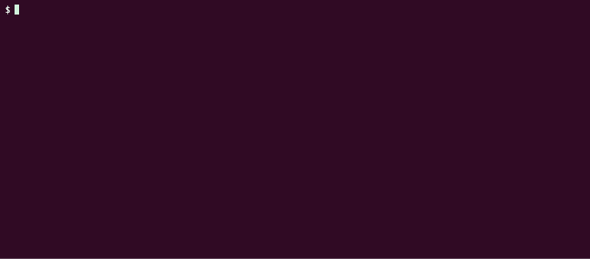

# Maze 3D
[](https://github.com/yoshihicode/maze3d/releases/latest)


Maze 3D is a terminal-based 3D maze game written in Go.

## ⚙️ Features
- 🕹️ Terminal-based gameplay
- 🧊 3D maze
- 🔦 Ray casting
- 💻 Cross-platform support (Linux, macOS, Windows)

## 💾 Download
Download prebuilt binaries from the latest release:  
👉 [Get the latest binaries](https://github.com/yoshihicode/maze3d/releases/latest)

## 📦 Installation
### 🐧 Linux
```bash
wget https://github.com/yoshihicode/maze3d/releases/latest/download/maze3d_linux_amd64.tar.gz
tar -xzvf maze3d_linux_amd64.tar.gz
sudo mv maze3d /usr/local/bin/

# Run
maze3d
```
### 🍎🍺  macOS / Homebrew
```bash
brew tap yoshihicode/tap
brew install maze3d

# Run
maze3d
```
### 🪟 Windows
```powershell
Invoke-WebRequest -OutFile maze3d_windows_amd64.tar.gz https://github.com/yoshihicode/maze3d/releases/latest/download/maze3d_windows_amd64.tar.gz
tar -xzvf maze3d_windows_amd64.tar.gz

# Run
.\maze3d.exe
```
## 🎮 Controls
### 🏠 Title Screen
| Key | Action |
|:---:|:---|
| `Enter` | Start Game |
| `M` | MiniMap (ON / OFF) |
| `Esc` | Quit |

### 🕹️ Playing
| Key | Action |
|:---:|:---|
| `W` / `S` | Move Forward / Backward |
| `A` / `D` | Turn Left / Right |
| `G` | Give up |
| `Esc` | Quit |

### 🏁 Game Result (Cleared / Give up)
| Key | Action |
|:---:|:---|
| `N` | New Game (Random Maze) |
| `T` | Try Again (Same Maze) |
| `Enter` | Back to Title |
| `Esc` | Quit |

## 🛠️ Build from Source
```bash
git clone https://github.com/yoshihicode/maze3d.git
cd maze3d
go build -o maze3d main.go
./maze3d
```
## References
### For maze generation
- https://note.com/mahalo_/n/na0739a515a43
- https://zenn.dev/megeton/articles/5b16208f5d9678


### For ray casting
- https://www.youtube.com/watch?v=Mtf4rz9UEQo
- https://scratch.best/practice/3d-game-raycasting
- https://ja.scratch-wiki.info/wiki/%E3%83%AC%E3%82%A4%E3%82%AD%E3%83%A3%E3%82%B9%E3%83%86%E3%82%A3%E3%83%B3%E3%82%B0#:~:text=%E3%83%AC%E3%82%A4%E3%82%AD%E3%83%A3%E3%82%B9%E3%83%86%E3%82%A3%E3%83%B3%E3%82%B0%E3%81%AF%E3%80%81%E8%A6%96%E7%82%B9%E3%81%8B%E3%82%89,%E3%81%99%E3%82%8B%E6%96%B9%E6%B3%95%E3%81%8C%E5%8F%96%E3%82%89%E3%82%8C%E3%82%8B%E3%80%82
- https://permadi.com/1996/05/ray-casting-tutorial-5/
- https://lodev.org/cgtutor/raycasting.html
- https://note.com/1_murata/n/nb6a8c84a80b9
- https://note.com/1_murata/n/n0a08e6694347